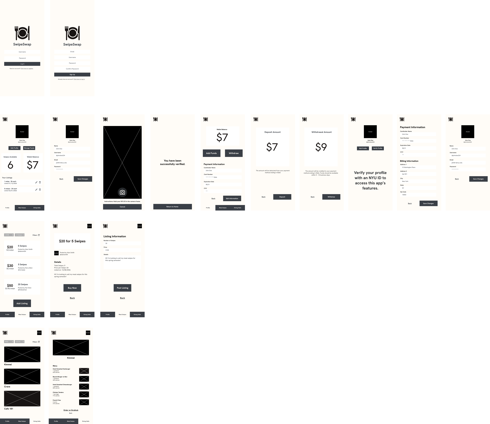

# Specification Phase Exercise

A little exercise to get started with the specification phase of the software development lifecycle. See the [instructions](instructions.md) for more detail.

## Team members

- Hanson Huang [(Github)](https://github.com/Hansonhzh)
- Aaron Hui [(Github)](https://github.com/aaronthmetic)
- Sarah Randhawa [(Github)](https://github.com/sarahrandhawa)
- Marcus Song [(Github)](https://github.com/Marclous)
- Han Xiao    [(Github)](https://github.com/vick12333)

## Stakeholders

See instructions. Delete this line and replace with the name(s) of the stakeholder(s) you interviewed and lists showing their goals/needs, and problems/frustrations.

## Product Vision Statement

An app to help students manage their on-campus dining needs by buying and selling meal swipes, ordering food, and viewing dining hall availability.

## User Requirements

User Type: Buyer
1. As a buyer, I want to be able to buy meal swipes and meals so that I can not be hungry.
2. As a buyer, I want to be able to connect to the Grubhub menu directly in-app so I can efficiently order food.
3. As a buyer, I want to be able to place orders from the menu directly in-app so that my order can be placed hassle-free.
4. As a buyer, I want to be able to filter sellers by price so that I can save the most money on food/
5. As a buyer, I want to access my profile tab to edit my personal information.
6. As a buyer, I want to view how many swipes I own so that I could manage my usage.
7. As a buyer, I want to be able to view the hours of dining halls so that I know when the earliest/latest I can go and pick up food is.
8. As a buyer, I want to see the occupancy/how busy the dining spaces are so I can save time by not waiting in line.
9. As a buyer, I want to filter a list of dining halls by category so I can efficiently find where I want to eat.
10. As a buyer, I want to deposit money into the app so I can buy meal swipes.
11. As a buyer, I want to be able to add a payment method into the app so that I can buy meal swipes without having to deposit money each time.

User Type: Seller
1. As a seller, I want to be able to sell meal swipes so I can turn extra swipes into money.
2. As a seller, I want to be able to connect to the Grubhub menu directly in-app so I can efficiently order food.
3. As a seller, I want to be able to place orders from the menu directly in-app so that my order can be placed hassle-free. (fix in uml diagram so i can choose what i want)
4. As a seller, I want to be able to filter sellers by price so that I can save the most money on food/
5. As a seller, I want to access my profile tab to edit my personal information.
6. As a seller, I want to select the price at which I will sell meal swipes
7. As a seller, I want to be notified when someone buys my meal swipes
8. As a seller, I want to transfer money from my sales out of the app
9. As a seller, I want to be able to add a payment method into the app so that I can receive payment without having to transfer money out of my account each time
10. As a seller, I want to be able to view the hours of dining halls so that I know when the earliest/latest I can go and pick up food is.
11. As a seller, I want to see the occupancy/how busy the dining spaces are so I can save time by not waiting in line.
12. As a seller, I want to filter a list of dining halls by category so I can efficiently find where I want to eat.

## Activity Diagrams

See instructions. Delete this line and place images of your UML Activity diagrams here.

## Wireframes

## Clickable Prototype

See instructions. Delete this line and place a publicly-accessible link to your clickable prototype here.
